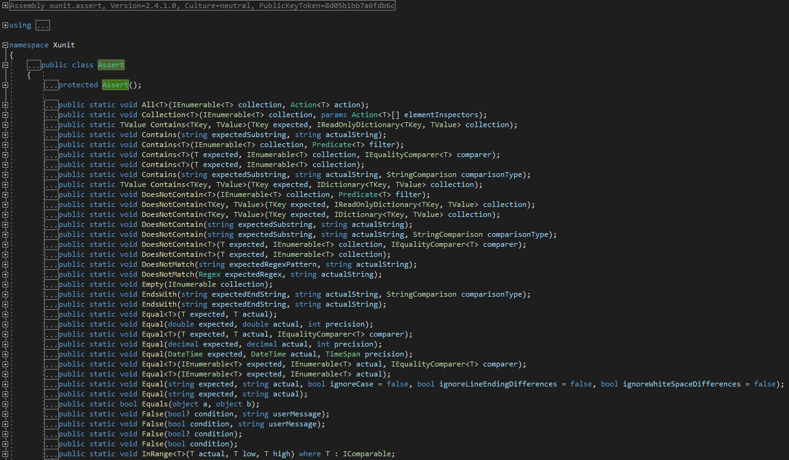
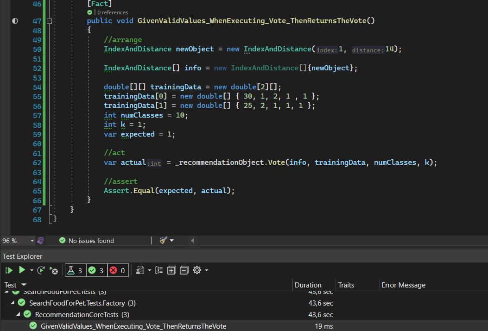

## Biblioteca de Aserciones Usada

El marco de prueba xUnit emplea la API Assert como biblioteca de aserciones y esta es la que yo utilizo en mi proyecto. Comienzo nombrando el marco de prueba xUnit pues fue el que elegí para la realización de mis test unitarios. Puede acceder a la justificación de mi elección [aquí](https://github.com/ccvaillant1992/SearchFood-ForPet/blob/master/docs/MarcoDePrueba.md)
xUnit, cuando carga el proyecto de prueba para poder encontrar las pruebas dentro de la solución y ejecutarlas, busca métodos que tengan este atributo [Fact]. Y para decir que pasó y qué falló emplea la API proporcionada por la clase llamada Assert que se encuentra en dicho namespace xUnit. Puedes verlo abajo en la captura.

Como puedes apreciar, la captura anterior muestra los diferentes métodos que me proporciona esta librería de aserción, y me posibilita la realización de mis test. 

También quiero mencionarte el estilo que elegí para la realización de mis test. Este es Behavior Driven Development (BDD). Empleando la estrategia BDD, las pruebas realizadas se centran en el usuario y el comportamiento del sistema. Con el empleo de este estilo apoyado de la librería de aserciones mencionada anteriormente aumenta mi confianza cuando desarrollo el código de mi proyecto. También se que la posibilidad de fallos que presentaré será cada vez menor.

A continuación se muestra una captura del test realizado para la [HU 1 Como usuario del sistema, quiero que SearchFood-ForPet me recomiende una dieta personalizada para mi mascota, para poder cubrir las necesidades nutricionales de mi mascota.](https://github.com/ccvaillant1992/SearchFood-ForPet/issues/5)

