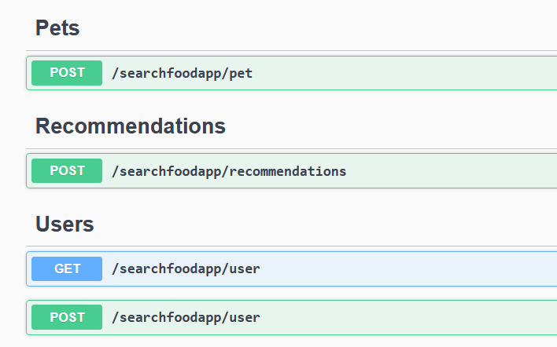

## Diseño de la API REST

## Endpoints


## Pets

### Add Pets

- Request body -> Características de la mascota
```
{
  "idUser": "3fa85f64-5717-4562-b3fc-2c963f66afa6",
  "weight": 0,
  "age": 1,
  "size": 1,
  "sex": 1,
  "activity": 1,
  "healthCondition": [
    1
  ]
}
```
- Returns -> Status Code 200
```
{
    "idPet": "65603c04-df25-45d3-a9ce-38493d8d35dd",
    "idUser": "3fa85f64-5717-4562-b3fc-2c963f66afa6",
    "weight": 0.0,
    "age": 1,
    "size": 0,
    "sex": 0,
    "activity": 1,
    "healthCondition": [
        1
    ]
}
```
- Returns -> Status Code 400: Entrada de datos inválida
- Returns -> Status Code 500: Error interno del servidor

## Recommendations

- Request body -> Mascota para la cual se quiere obtener una recomendación
```
{
  "idPet": "3fa85f64-5717-4562-b3fc-2c963f66afa6",
  "idUser": "3fa85f64-5717-4562-b3fc-2c963f66afa6",
  "weight": 0,
  "age": 1,
  "size": 1,
  "sex": 1,
  "activity": 1,
  "healthCondition": [
    1
  ]
}
```
- Returns -> Status Code 200
```
{
    "idFood": 1,
    "size": 1,
    "healthCondition": 1,
    "diet": 1,
    "kind": 1,
    "taste": 3
}
```
- Returns -> Status Code 400: Entrada de datos inválida
- Returns -> Status Code 500: Error interno del servidor

## Users

### Get Users

- Returns -> Status Code 200
```
[
    {
        "idUser": "8edd5914-19df-49bf-977a-97e17f7916dc",
        "name": "Cristina",
        "emailUser": "ccvaillant@gmail.com",
        "location": "",
        "petNames": [
            "Mazuka",
            "Kalesy"
        ]
    },
    {
        "idUser": "b1bd09ac-c2d4-40ed-a9bd-0a51c8c13f4c",
        "name": "Noel",
        "emailUser": "noel@gmail.com",
        "location": "",
        "petNames": [
            "Tuko"
        ]
    }
]
```
- Returns -> Status Code 500: Error interno del servidor

### Add Users

- Request body -> Información básica del usuario
```
{
  "name": "Laura",
  "emailUser": "laura@gmail.com",
  "location": "string",
  "petNames": [
    "Yuki"
  ]
}
```
- Returns -> Status Code 200
```
{
    "idFood": 1,
    "size": 1,
    "healthCondition": 1,
    "diet": 1,
    "kind": 1,
    "taste": 3
}
```
- Returns -> Status Code 400: Entrada de datos inválida
- Returns -> Status Code 500: Error interno del servidor

|**Atributos** |**Tipo de Dato** |
|-----------|--------------|
|idPet|Guid|
|weight|double|
|age|enum PetAge [Puppy=1, Junior=2, Senior=3]|
|size|enum PetBreedSize [Small=1, Medium=2, Large=3]|
|sex|num PetSex [Male=1, Feminine=2]|
|activity|enum PetActivityLevel [High=1, Medium=2, Low=3]|
|healthCondition|enum PetHealthCondition [Allergy=1, WeightControl=2, Digestive=3, Sterilized=4, Urinary=5, HairAndSkin=6, JointReinforcement=7, Healthy=8]|
|diet|enum DietType [Natural=1, NonCereals=2, NonGluten=3, WithProtein=4]|
|kind|enum FoodKind [Dry=1, Wet=2, Raw=3, Homemade=4]|
|taste|enum FoodTaste [Vegetable=1, Tuna=2, Chicken=3, Pork=4]|
|idUser|Guid|
|Name|string|
|EmailUser|string|
|Location|string|
|PetNames|string|
