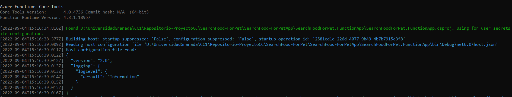
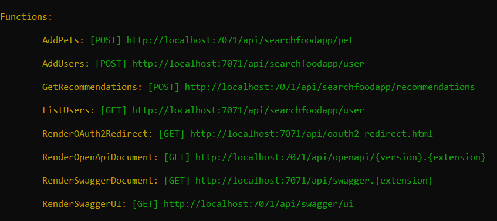
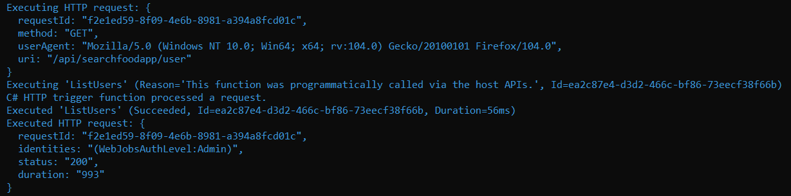

## Framework elegido para el microservicio

Para el desarrollo de la API RESt de mi proyecto he utilizado Azure Functions. 

|**Nombre** |**Valor** |
|-----------|----------|
|Lenguaje   | C#       |
|Plantilla  | HTTP Triguer with Open API|

Entre las tecnologías más usadas en proyectos desarrollados con .Net Core, se encuentran: ASP.NET Core Web API y Azure functions. 

- ¿Por qué he elegido Azure Functions?

Azure Functions es una plataforma sin servidor, la considero la opción ideal para las APIs ya que puede compilar rápidamente API de HTTP para las aplicaciones web sin la complicación de los marcos web. Es un servicio sin servidor en el cual solo se cobra cuando se llama a un punto de conexión HTTP. Cuando los puntos de conexión no están en uso, no se cobra. Permite la configuración de las variables de entorno, relacionadas a los servicios con los que va a interactuar, en el archivo de configuración que contiene, llamado: local.settings.json. También permite realizar la administración de los logs a través de la extensión soportada Loggin. Es multiplataforma, y soporta el desarrollo con diversos lenguajes de programación como por ejemplo: python, c#, java, entre otros. Además, posibilita la combinación de su uso con herramientas como Swagguer.

- Ejecución del proyecto de Azure Functions

Al iniciar el proyecto de Azure Functions se puede observar que en el terminal se muestra la dirección URL en la que se ejecuta la función.

Más información sobre Azure Functions se puede consultar [aquí](https://azure.microsoft.com/es-es/services/functions/#overview)

Otra de las herramientas empleadas para el desarrollo del microservicio fue Swagger. 
Swagger es una herramienta de código abierto que brinda facilidades para diseñar, crear, documentar y consumir API REST. 

Para obtener más información acerca de Swagger,consulte este [enlace](https://swagger.io/solutions/getting-started-with-oas/)

## Buenas Prácticas
Con el objetivo de crear un software de calidad, confiable y fácil de mantener, se han implementado a continuación un conjunto de buenas practicas:
- Se ha evitado implementar funciones muy complejas y de larga duración. Cada función tiende al principio de responsabilidad única.
- Los puntos de conexión empleados en la API siguen en el nombre, el patrón tradicional de nomenclatura de API: acción/recurso, ejemplo: api/searfoodapp/user
- Se han utilizado versiones de frameworks estabes y oficiales del proveedor, ejemplo: net6
- Se ha realizado la programación de las funciones de forma asíncrona
- Está separada la lógica del negocio de la API implementada, permitiendo la extensión del proyecto con el desarrollo del front-end y el acceso a datos de forma separada e independiente cada uno. 
- Se han implementado test unitarios a los proyectos desarrollados. 

## Uso de logs
Al usar Azure Functions, es posible administrar los logs a través de la extensión de Logging para .Net **Log Level**. De esta forma, se puede ver en la consola sólo los mensajes que necesita el desarrollador y así poder realizar depuraciones más rápidas y eficientes.
Log Level se puede configurar en el archivo de configuración de la function «host.json». En este se puede gestionar el nivel de logging que deseamos mostrar y así podemos ver nuestros propios mensajes.
 
 - Niveles de configuración de Log Level

- Archivo de configuración [host.json](https://github.com/ccvaillant1992/SearchFood-ForPet/blob/master/SearchFood-ForPetApp/SearchFoodForPet.FunctionApp/host.json) del proyecto SearchFoodForpet y ejemplo de su uso:

Acceda a este enlace para obtener más información acerca de [Log Level](https://docs.microsoft.com/es-es/dotnet/api/microsoft.extensions.logging.loglevel?view=dotnet-plat-ext-3.1)
