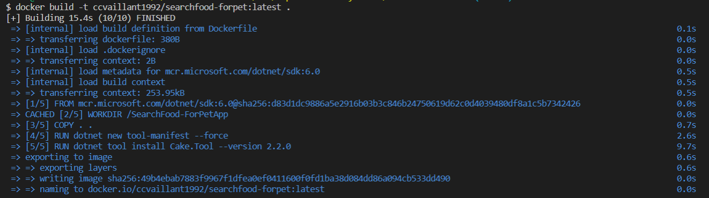
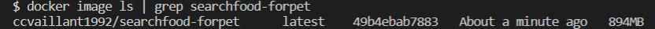
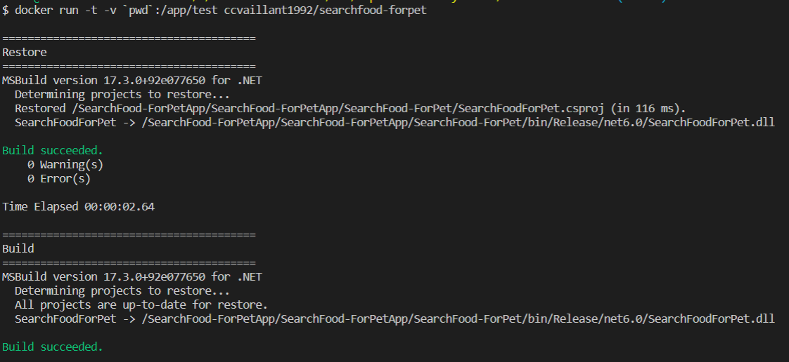
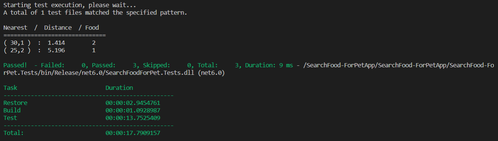

## Elección del Contenedor Base
Para la elección de la imagen contenida en el contenedor base de docker de mi proyecto, me guié por la siguiente [documentación](https://docs.microsoft.com/es-es/dotnet/architecture/microservices/net-core-net-framework-containers/official-net-docker-images) oficial de Microsoft.
Como se explica en dicha documentación, Microsoft se centró en dos escenarios principales cuando los desarrolladores compilan imágenes de Docker:

- Imágenes que se usan para desarrollar y compilar aplicaciones de .NET.(enfocadas al entorno de desarrollo)
- Imágenes que se usan para ejecutar aplicaciones de .NET. (enfocadas al entorno de producción)

Como mi proyecto se encuentra en la fase de desarrollo, la imagen recomendada durante el proceso de desarrollo y compilación es la imagen de .NET de desarrollo (mcr.microsoft.com/dotnet/sdk:6.0). Esta imagen también se usa en el entorno de integración continua (CI).

Los pasos empleados para la compilación y ejecución de los tests unitarios del proyecto en el archivo [Dockerfile](https://github.com/ccvaillant1992/SearchFood-ForPet/blob/master/Dockerfile) son los siguientes:

- Construcción de la imagen de docker 

- Comprobación de la imagen recientemente publicada

- Restauración y compilacion del proyecto a través del gestor de tareas definido **Cake**

- Ejecución de los tests unitarios a través del gestor de tareas definido **Cake**

