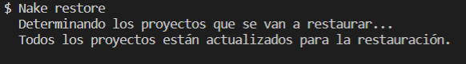
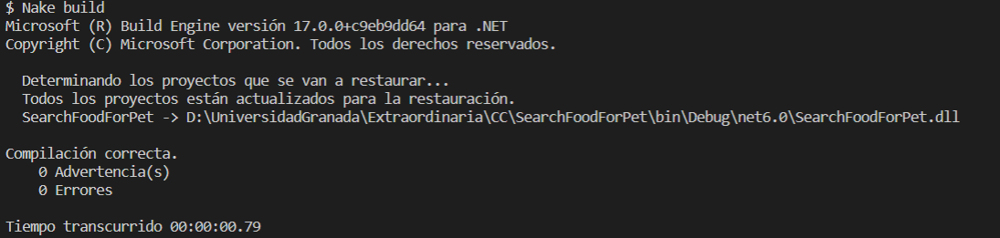
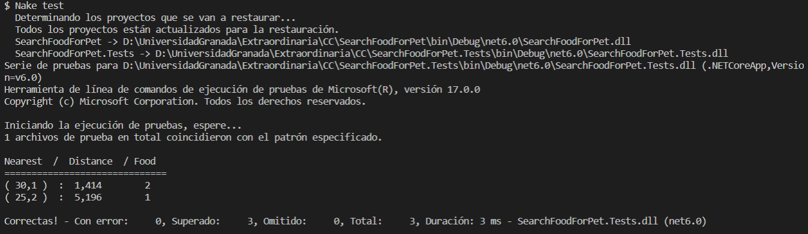

## Elección y uso del Gestor de Tareas

Con el uso de un gestor de tareas puedo realizar scripts definidos de manera repetitiva y muy fácil, brindándome la posibilidad de ejecutar comandos que me permiten realizar la construcción de mi proyecto, restaurar sus dependencias y ejecutar los tests unitarios realizados de manera rápida.

Como gestor de tareas para mi proyecto he elegido Nake. Nake es una herramienta de ejecución de tareas para .NET, que puede ser empleada para tareas como compilar el código del proyecto, restaurarlo, ejecutar tests unitarios, entre otras opciones. Es muy sencillo y compatible con proyectos ASP.Net Core en Visual Studio y Visual Studio Code. 

Existen otros gestores de tareas como grunt, Gulp, empleados en otros lenguejes de programación y además, otras alternativas a Nake, que se pueden revisar [aquí](https://dotnet.libhunt.com/nake-alternatives). 

Para la instalación de la herramienta Nake, lo primero que realicé fue ejecutar el siguiente comando:


Por último creé el archivo llamado Nake.csx y añadí los comandos a ejecutar en el script:

```
dotnet restore 

dotnet build 

dotnet test 

```

Vea a continuación el [Gestor de Tareas](https://github.com/ccvaillant1992/SearchFood-ForPet/blob/master/Nake.csx) definido y la ejecución de los comandos mencionados anteriormente:

- Restaurar las dependencias empleadas en el archivo .csproj



- Construcción de mi proyecto



- Ejecución de los tests unitarios definidos en el proyecto




