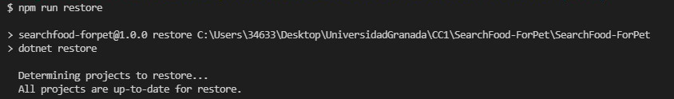
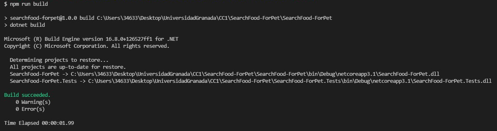
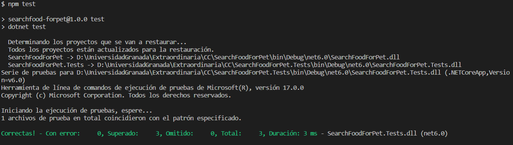

## Elección y uso del Gestor de Tareas

Con el uso de un gestor de tareas puedo realizar scripts definidos de manera repetitiva y muy fácil, dándome posibilidad de ejecutar comandos que me permiten realizar la construccion de mi proyecto, restaurar sus dependencias y ejecutar losb tests unitarios realizados de manera rápida.

Como gestor de tareas para mi proyecto he elegido npm. Es muy sencillo y compatible con proyectos ASP.Net Core en Visual Studio y Visual Studio Code. Existen otros gestores de tareas como grunt, Make, Gulp, pero por el lenguaje de programación y el framework empleado en el desarrollo del proyecto SearchFood-ForPet, npm es el más compatible de entre los mencionados anteriormente.

Lo primero que realicé fue añadir a la solución de mi proyecto el archivo package.json del gestor de tareas npm, ya que no venía por defecto al crear la solución del proyecto. Vea a continuación una captura de cómo lo realicé:

Posteriormente, añadí los comandos a ejecutar en el script:

dotnet restore --> para restaurar las dependencias empleadas en el archivo .csproj
dotnet build ---> para la construcción de mi proyecto
dotnet test ---> para la ejecución de los tests unitarios definidos en el proyecto

Vea a continuación el [Gestor de Tareas](https://github.com/ccvaillant1992/SearchFood-ForPet/package.json) definido y la ejecución de los comandos:

