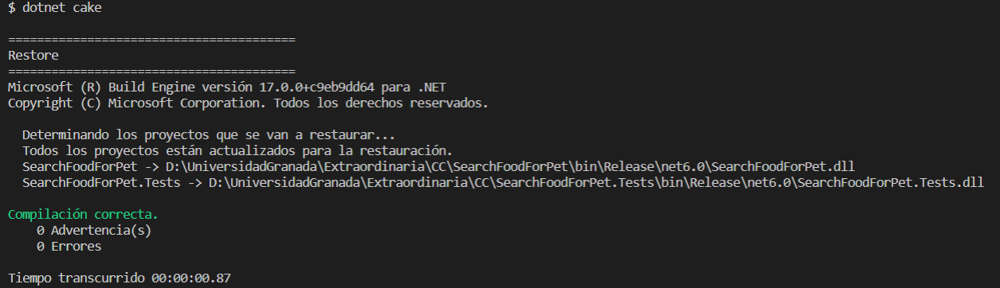

## Elección y uso del Gestor de Tareas

Con el uso de un gestor de tareas puedo realizar scripts definidos de manera repetitiva y muy fácil, brindándome la posibilidad de ejecutar comandos que me permiten realizar la construcción de mi proyecto, restaurar sus dependencias y ejecutar los tests unitarios realizados de manera rápida.

Como gestor de tareas para mi proyecto he elegido Cake(C# Make). Cake es un sistema de automatización de compilación multiplataforma gratuito y de código abierto con C# DSL, que puede ser empleado para tareas como compilar el código del proyecto, restaurarlo, ejecutar tests unitarios, entre otras opciones. Es muy sencillo y compatible con proyectos ASP.Net Core en Visual Studio y Visual Studio Code. En [esta](https://cakebuild.net/docs/running-builds/runners/) documentación se puede apreciar la compatibilidad que tiene Cake con nuevas versiones del framework .Net como es .net6, diferentes sistemas operativos soportados(Windows, macOs y Linux), además de su compatibilidad con reconocidos sistemas de integración continua como por ejemplo: Azure Pipelines, Git Hub Actions, TravisCI, entre otros.

Existen otros gestores de tareas como grunt, Gulp, empleados en otros lenguejes de programación y además, otras alternativas a cake, que se pueden revisar [aquí](https://dotnet.libhunt.com/cake-alternatives). 

Para la instalación de la herramienta Cake, lo primero que realicé fue asegurarme de tener la herramienta manifest disponible en el repositorio:


Posteriormente instalé Cake con el siguiente comando:


Por último creé el archivo llamado build.cake y añadí los comandos a ejecutar en el script:

```
dotnet restore 

dotnet build 

dotnet test 

```

Vea a continuación el [Gestor de Tareas](https://github.com/ccvaillant1992/SearchFood-ForPet/blob/master/build.cake) definido y la ejecución de los comandos mencionados anteriormente:

- Restaurar las dependencias empleadas en el archivo .csproj



- Construcción de mi proyecto


- Ejecución de los tests unitarios definidos en el proyecto


