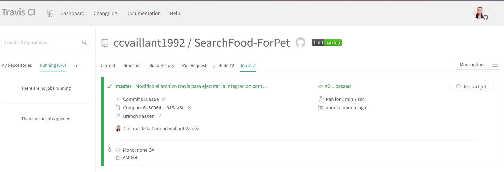
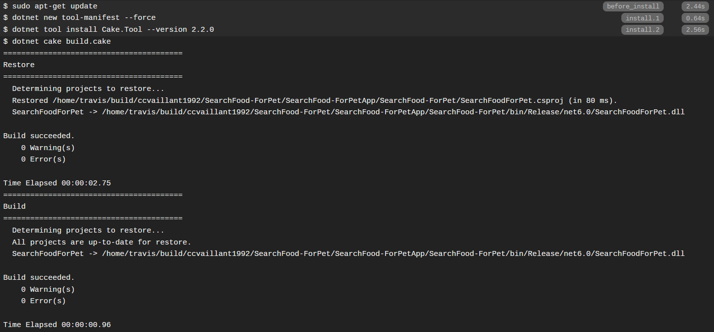
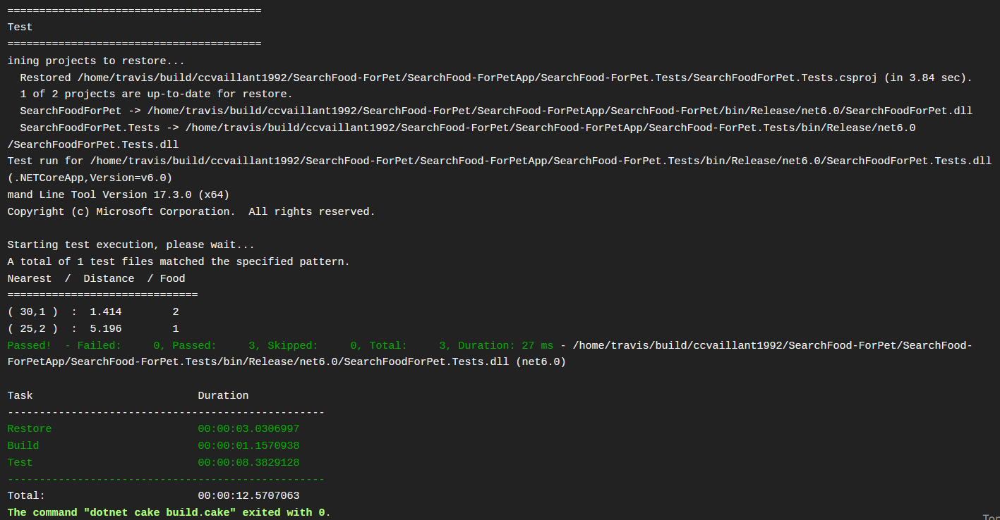
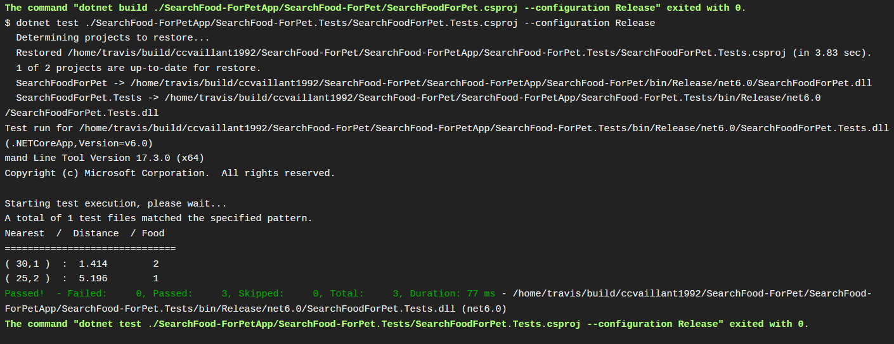

## Integración Continua a través de Travis CI

Aplicar la Integración continua en mi proyecto facilita la correccción de errores a tiempo, ya que cada vez que mergeo las nuevas funcionalidades implementadas al código fuente almacenado en la rama principal del proyecto, puedo conocer si algunas de las funcionalidades añadidas contiene algún error y revisarlo. Con esto no tengo que esperar a que finalize la implementación de la aplicación, para validar si funciona. Por tanto, la integración continua de conjunto con otras herramientas, me permite tener un código saludable y limpio durante todas las etapas del proceso de desarrollo del proyecto.  

Existen diversos sistemas de integración continua disponibles de forma gratuita, que me brindan estas ventajas. Entre ellos se encuentra Travis CI, un potente sistema que facilita la automatización construcción, desarrollo y testeo del proyecto, entre otras funcionalidades. 

Para la configuración de la integración continua en mi proyecto a través de Travis CI, me he guiado por la siguiente [documentación](https://docs.travis-ci.com/user/languages/csharp/) que explica detalladamente los pasos a seguir para su configuración con el lenguaje de programación c#.

Los pasos que he realizado son los siguientes:

- Configuración de la cuenta en Travis CI y accesso al repositorio de GitHub

- Configuración del fichero de [.travis.yml](https://github.com/ccvaillant1992/SearchFood-ForPet/blob/master/.travis.yml) en el proyecto y ejecución de la integración continua a través del gestor de tareas empleado: Cake. 

- Logs de la ejecución en Travis CI 

