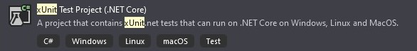

## Marco de Prueba

Con el objetivo de probar las funcionalidades de mi código y verificar que se comportan correctamente según lo esperado, es necesario escribir test unitarios. Cada unidad de dichos test, constituirá el código que quiero probar y esta unidad debe ser lo más pequeña posible. Los test unitarios son automáticos, y los puedo realizar a través de un marco de prueba, que el empleo del framework .NET en mi proyecto me permite ejecutar estos test utilizando para ello, el comando ```dotnet test ```. De esta forma, la ejecución en primer lugar me encuentra los test unitarios que he escrito, posteriormente ejecuta cada uno de ellos y finalmente me brinda un reporte mostrando si los test pasaron la prueba o no.

Utilizando el lenguaje de programación C# con el framework .NET en mi proyecto, puedo decidir qué marco de prueba utilizar para realizar los test unitarios y entre los más utilizados y nombrados se encuentran: xUnit, MSTest y NUnit. Teniendo en cuenta la siguiente [documentación](https://docs.microsoft.com/en-us/dotnet/core/testing/), he realizado una tabla resumen con los 3 marcos de prueba antes mencionados:

| Criterio | MSTest | NUnit |xUniT | Comentarios|
|----------|--------|-------|------|------------|
|Sobre el marco de Prueba|MSTest es el marco de prueba predeterminado que viene con Visual Studio. La versión inicial de MSTest (V1) no era de código abierto; pero, la versión MSTest V2 es de código abierto|NUnit es un marco de prueba de código abierto portado desde JUnit|xUnit es un marco de prueba de código abierto basado en el marco .NET. Se creó para suceder a NUnit. xUnit aprovecha algunas de sus características avanzadas para escribir pruebas más limpias que son más fáciles de depurar y ejecutar que en NUnit.|-|
|Atributos que emplea para marcar el método de prueba|[TestMethod]|[Test]|[Fact]|-|
|API para probar el método |Assert.AreEqual|Assert.AreEqual|Assert.Equal|Misma API para probar el método implementado, varía el método empleado por la clase Assert.|
|Constructor|-|[SetUp]|-|NUnit define de manera predeterminada un constructor, en los restantes marcos los pudiera definir, pero no es obligatorio.|
|Convención empleada para la organización y entendimiento del test|-Arrange -Act -Assert|-Arrange -Act -Assert|-Arrange -Act -Assert| 
|Atributos que emplea para indicar que la clase tiene un grupo de pruebas unitarias|[TestClass]|[TestFixture]|-|El marco xUnit proporciona un aislamiento mucho mejor de las pruebas en comparación con los marcos NUnit y MSTest. Para cada caso de prueba, la clase de prueba se crea una instancia, se ejecuta y se descarta después de la ejecución. Esto garantiza que las pruebas se puedan ejecutar en cualquier orden, ya que hay una dependencia reducida o nula entre las pruebas. Ejecutar cada prueba como una instancia separada minimiza las posibilidades de que una prueba provoque que las otras fallen|
|Extensibilidad|Muchos atributos presentes [ClassCleanup], [ClassInitialize], [TestInitialize], [TestCleanup]|Muchos atributos presentes [OneTimeSetUp], [OneTimeTearDown], [SetUp], [TestFixture]|Utiliza los atributos [Fact] y [Theory]|El atributo [Teoría] para pruebas parametrizadas en xUnit es uno de los principales ejemplos de la extensibilidad del marco que también hace que la implementación de la funcionalidad personalizada sea mucho más fácil|

Como conclusión, para el desarrollo de mi proyecto he decidido emplear el marco de prueba xUnit no solo por su simplicidad de uso, sino que también xUnit es una herramienta gratuita centrada en la comunidad de código abierto de .Net, además, es más extensible y tiene menos atributos, lo que hace que el código sea limpio y fácil de mantener.




