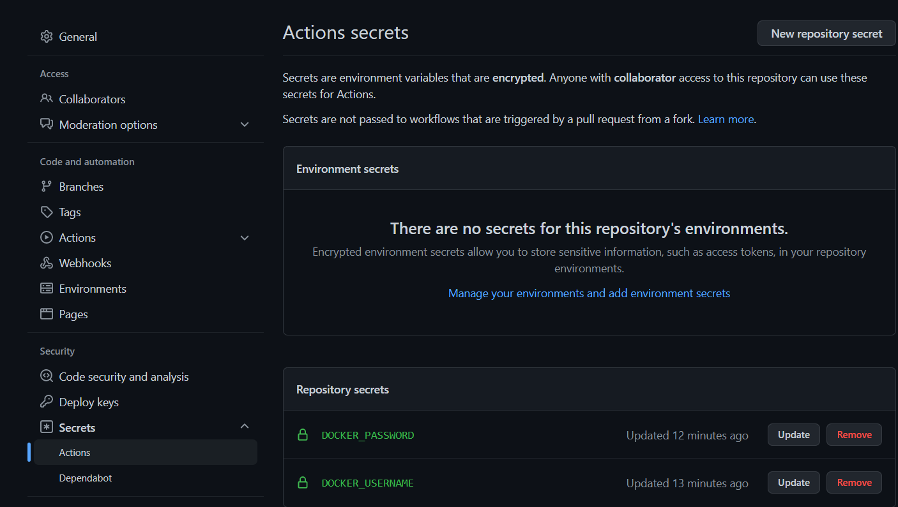

## Publicación del Contenedor a Docker Hub

Para la realización de la publicación del contenedor base definido en el proyecto a Docker Hub y su actualización automática, he realizado los siguientes pasos:

- Configuración de la cuenta, datos de accesso y del repositorio en Docker Hub

- Configuración de los secretos para las acciones de Git Hub 

La GitHub Action que permite la publicación a Docker Hub del contenedor y configurada para la realización de los pasos básicos definidos en el gestor de tareas es [esta](https://github.com/ccvaillant1992/SearchFood-ForPet/blob/master/.github/workflows/docker-image.yml).

- Ejecución de la GitHub Action definida

