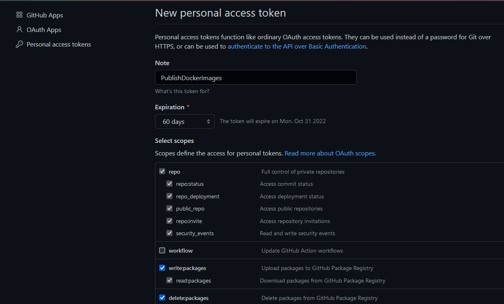
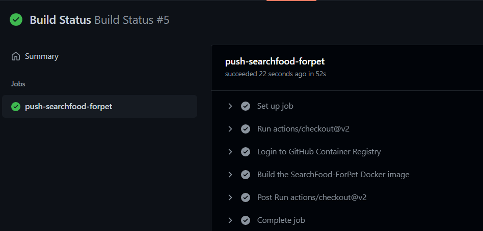

## Publicación del Contenedor a Git Hub Container Registry

Para la realización de la publicación del contenedor base definido en el proyecto y su actualización automática además de emplear Docker Hub, he empeleado Git Hub Container Registry. Una de las razones de mi elección, además de la simplicidad de su utilización, es que su uso Github no tiene límite de créditos, esta acción se encuentra disponible con GitHub Free. Además permite subir imagánes de Docker a GitHub Packages, mostrándose en el mismo repositorio si es especificada con visibilidad pública, y dando acceso a otras personas hacer uso de ellas. 

Los pasos que realicé para la configuración son los siguientes:

- Configuración de un PAT(Pesonal Access Token), solo con posibilidad de acceder al repositorio y administrar los paquetes

- La GitHub Action que permite la publicación del contenedor base en GitHub Container Registry y su actualización automática es [esta](https://github.com/ccvaillant1992/SearchFood-ForPet/blob/master/.github/workflows/docker-image-GHCR.yml).

- Ejecución de la GitHub Action definida

- Imagen subida a la sección GitHub packages en el repositorio

