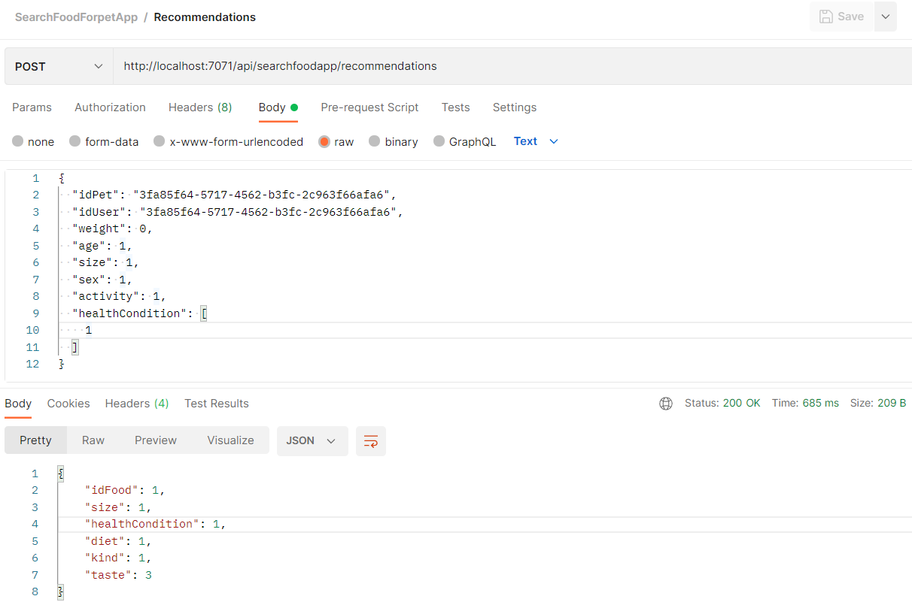
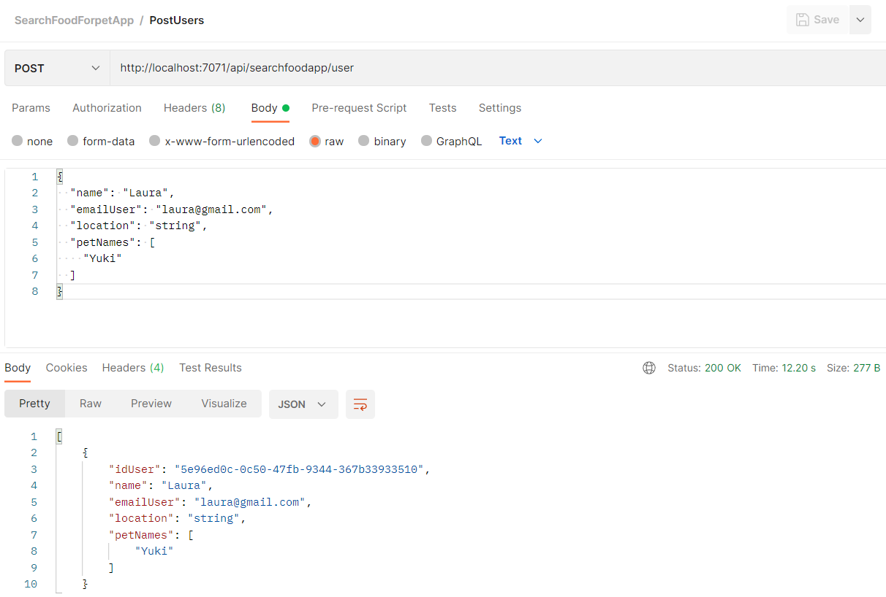
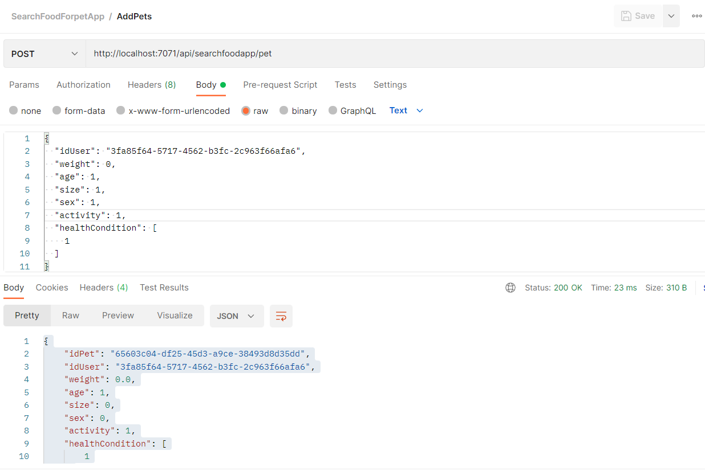

## Tests en relación con las HUs

Para el testeo de los endpoints de la API Rest, se emplearon dos herramientas:
- Swagger
- Postman

### Historias de usuarios y Test realizados a través de Postman

- [HU 1: Como usuario del sistema, quiero que SearchFood-ForPet me recomiende una dieta personalizada para mi mascota, para poder cubrir las necesidades nutricionales de mi mascota](https://github.com/ccvaillant1992/SearchFood-ForPet/issues/5)

- [HU 2: Como usuario del sistema, quiero que SearchFood-ForPet me permite añadir mi información básica, para poder añadir las características de mi mascota](https://github.com/ccvaillant1992/SearchFood-ForPet/issues/6)

- [HU 3: Como usuario del sistema, quiero que SearchFood-ForPet me permite añadir las características de mi mascota para poder recibir recomendaciones de dietas personalizadas para mi mascota](https://github.com/ccvaillant1992/SearchFood-ForPet/issues/8)

También se realizó el desarrollo de un proyecto de tests a los API endpoints. Para ello se utilizó como marco de prueba: xUnit, de conjunto con el framework Moq, como simulador para imitar el comportamiento de HTTP requests y el uso de logs. 

- Acceda a este [enlace](https://github.com/ccvaillant1992/SearchFood-ForPet/blob/master/SearchFood-ForPetApp/SearchFoodForPet.FunctionApp.Tests/Functions/RecommenderManagementFunctionTests.cs), para revisar los unit tests implementados correspondientes a la HU1. 

- Acceda a este [enlace](https://github.com/ccvaillant1992/SearchFood-ForPet/blob/master/SearchFood-ForPetApp/SearchFoodForPet.FunctionApp.Tests/Functions/UserManagementFunctionTests.cs), para revisar los unit tests implementados correspondientes a la HU2. 

- Acceda a este [enlace](https://github.com/ccvaillant1992/SearchFood-ForPet/blob/master/SearchFood-ForPetApp/SearchFoodForPet.FunctionApp.Tests/Functions/PetManagementFunctionTests.cs), para revisar los unit tests implementados correspondientes a la HU3. 